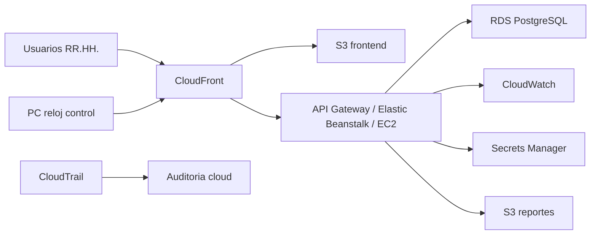

# Arquitectura AWS propuesta

## Vista general

CUBO se ejecuta localmente como MVP, pero esta preparado conceptualmente para desplegarse en AWS con separacion entre frontend estatico, API, datos, observabilidad y seguridad.

## Mapeo de servicios

- React/Vite: Amazon S3 y CloudFront.
- Express API: Elastic Beanstalk, EC2 o Lambda con API Gateway.
- PostgreSQL: Amazon RDS PostgreSQL.
- JWT local: futura migracion a Amazon Cognito.
- CSV: almacenamiento futuro en Amazon S3.
- Logs tecnicos: Amazon CloudWatch Logs.
- Auditoria de actividad AWS: CloudTrail.
- Secretos: AWS Secrets Manager.
- Cifrado: AWS KMS.
- Proteccion perimetral: AWS WAF.
- Deteccion y postura: GuardDuty y Security Hub.
- Respaldos: AWS Backup, snapshots RDS y S3 Versioning.
- Costos: AWS Budgets y Cost Explorer.

## Decisiones tecnicas

- API stateless para facilitar escalado horizontal.
- Base de datos relacional por trazabilidad y consistencia de marcajes.
- Auditoria aplicativa separada de la auditoria cloud.
- Configuracion por variables de entorno para separar ambientes.
